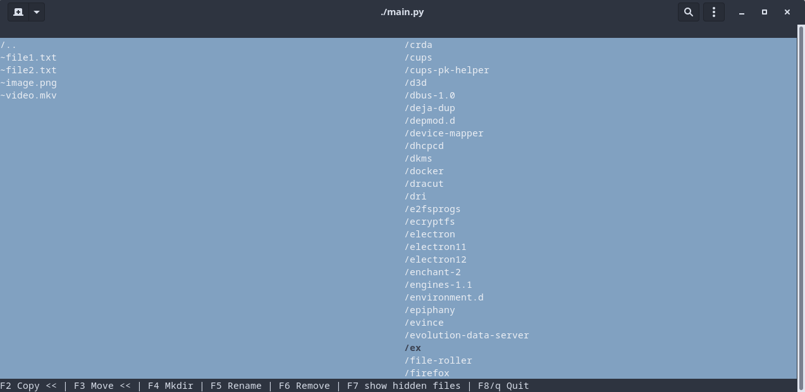
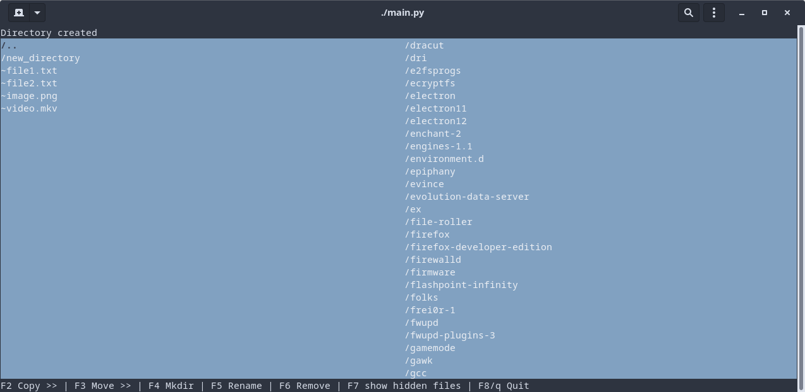

# Python Commander aka PyMander

Terminalowy menadżer plików na wzór Midnight Commandera napisany w Python z biblioteką [Urwid](http://urwid.org/).

## Uruchamianie

Do działania potrzebny jest python3 oraz biblioteka `urwid` (instalacja: `pip install urwid`).

W folderze `pymmander` znajduje się główny plik - `main.py`, który można uruchomić komendą `python3 main.py` lub nadając uprawnienia wykonywalne (`chmod +x main.py`) a następnie przez komendę `./main.py`.

## Działanie

Główna część interfejsu podzielona jest na dwie kolumny. W każdej kolumnie można poruszać się po drzewie plików i folderów. Przy pomocy klawiszy `F2`-`F8` można wykonać różne akcje:

- kopiowanie plików lub folderów
- przenoszenie plików/folderów
- tworzenie nowego folderu
- zmiana nazwy pliku/folderu
- usunięcie pliku/folderu
- pokazanie ukrytych plików
- wyjście

## Zrzuty ekranu

Interfejs programu

Nowy folder

